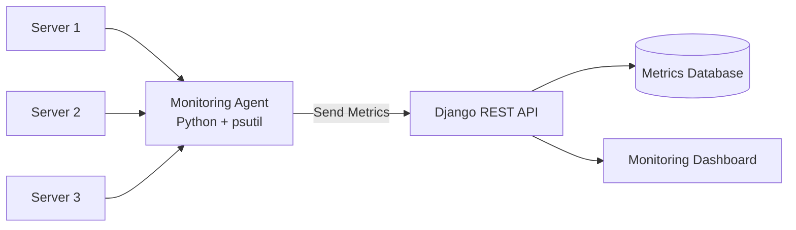

# Home Lab Monitoring Dashboard

  

A full-stack home lab monitoring system built with Django, Python agents, SQL, and a JavaScript dashboard.

## System Architecture

## Features

- Monitor multiple servers in a home lab
- Collect system metrics (CPU, RAM, Disk usage)
- Store metrics in a centralized database
- REST API for metric ingestion
- Web dashboard for visualizing system performance
- Modular architecture for adding new monitoring agents

Future Features
- Real-time metric updates
- Alerting and notifications
- Server uptime monitoring
- Docker deployment

## Tech Stack

### Backend
- Python
- Django
- Django REST Framework

### Monitoring Agent
- Python
- psutil

### Frontend
- JavaScript
- HTML/CSS
- Chart.js

### Database
- SQLite (development)
- PostgreSQL (production ready)

### Tools
- Git
- GitHub

## Setup

### 1. Clone the Repository

git clone https://github.com/YOURUSERNAME/homelab-monitoring-dashboard.git  
cd homelab-monitoring-dashboard

### 2. Create a Virtual Environment

python -m venv venv

Activate it:

Windows:
venv\Scripts\activate

Mac/Linux:
source venv/bin/activate

### 3. Install Dependencies

pip install -r requirements.txt

### 4. Run the Django Server

cd backend  
python manage.py runserver

The API will be available at:

http://127.0.0.1:8000

## Roadmap

### Phase 1 – Core Backend
- [ ] Django monitoring API
- [ ] Server registration
- [ ] Metrics ingestion endpoint

### Phase 2 – Monitoring Agent
- [ ] Python monitoring script
- [ ] Automatic metric reporting

### Phase 3 – Dashboard
- [ ] Web dashboard UI
- [ ] CPU / RAM / Disk charts
- [ ] Server overview page

### Phase 4 – Advanced Features
- [ ] Real-time monitoring
- [ ] Alerting system
- [ ] Authentication
- [ ] Docker deployment

## Screenshots

Screenshots of the monitoring dashboard will be added once the frontend is implemented.