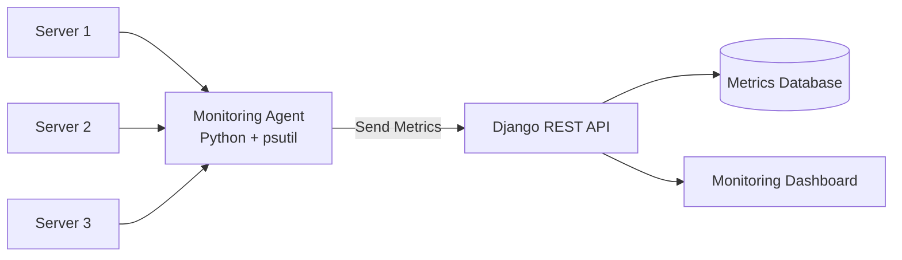

# Home Lab Monitoring Dashboard

  

A full-stack home lab monitoring system built with Django, Python agents, SQL, and a JavaScript dashboard.

## System Architecture

```mermaid
flowchart LR

Server1[Server 1]
Server2[Server 2]
Server3[Server 3]

Agent[Monitoring Agent<br>Python + psutil]

API[Django REST API]

DB[(Metrics Database)]

Dashboard[Monitoring Dashboard]

Server1 --> Agent
Server2 --> Agent
Server3 --> Agent

Agent -->|Send Metrics| API
API --> DB
API --> Dashboard
```